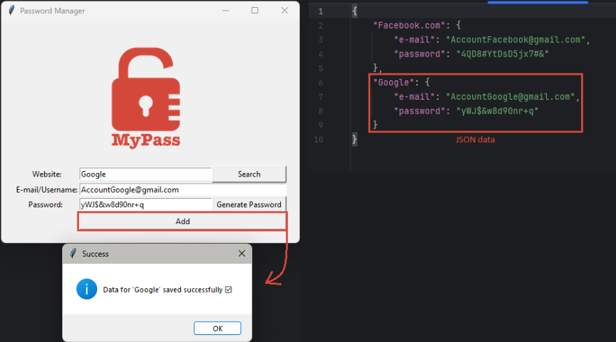
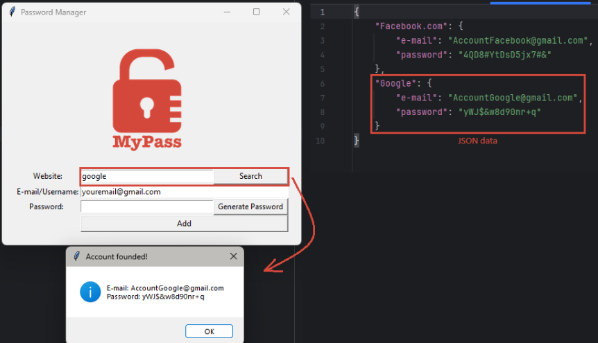

# Password Manager 🔒

A modernized Python application for generating, saving, and searching
secure passwords --- now using JSON storage and a search feature with
validation and case-insensitive lookup.

Built with **Tkinter** for the GUI and **Pyperclip** for clipboard
management.

------------------------------------------------------------------------

## 🚀 Features

-   **Generate strong passwords** with random letters, numbers, and
    symbols.\
-   **Copy automatically** the generated password to clipboard.\
-   **Save credentials** (website, e-mail, and password) locally in a
    `password.json` file.\
-   **Search saved accounts** easily with a case-insensitive and
    space-tolerant search.\
-   **Field validation** to prevent saving or searching empty inputs.\
-   **Clean and minimal Tkinter interface**.

------------------------------------------------------------------------

## 🧩 How It Works

1.  **Generate a password** using the "Generate Password" button.\
2.  The password will automatically be copied to your clipboard.\
3.  Enter the website and e-mail/username.\
4.  Click **Add** to save your credentials locally in `password.json`.\
5.  Use the **Search** button to quickly find previously saved logins
    (not case-sensitive).

------------------------------------------------------------------------

## 📦 Requirements

-   Python 3.10+\
-   Required modules:

``` bash
pip install pyperclip
```

------------------------------------------------------------------------

## ▶️ How to Run

1.  Make sure you have Python installed.\
2.  Place all files (`main.py`, `logo.png`, etc.) in the same
    directory.\
3.  Run the script:

``` bash
python main.py
```

------------------------------------------------------------------------

## 🧠 Skills Practiced

-   Python fundamentals and list comprehensions\
-   JSON file handling and exception management\
-   GUI development with Tkinter\
-   Clipboard manipulation using Pyperclip\
-   Data validation and user feedback with message boxes

------------------------------------------------------------------------

## 🖼️ Screenshot – Saving a New Account



## 🖼️ Screenshot – Searching for a Saved Account


------------------------------------------------------------------------

> 💡 This project is part of a learning path for improving Python GUI
> and file handling skills.
