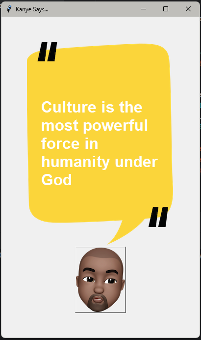

# 🐻 Kanye Quotes App

A simple **Python + Tkinter** application that displays random Kanye
West quotes using the public API `kanye.rest`.

This project was developed as an **educational exercise** to practice: -
Using APIs with `requests` - Building a graphical interface with
Tkinter - Loading and handling images - Organizing a small Python
project

## 🚀 Features

-   Button with Kanye's image\
-   Generates a new quote with each click\
-   Simple Tkinter-based GUI\
-   Uses external images for layout

## 📸 Demo



## 🛠 Technologies Used

-   **Python 3**
-   **Tkinter**
-   **Requests**

## 📦 How to Run

### 1️⃣ Clone the repository

``` bash
git clone https://github.com/YOUR_USERNAME/kanye-quotes-app.git
cd kanye-quotes-app
```

### 2️⃣ Install dependencies

``` bash
pip install -r requirements.txt
```

### 3️⃣ Run the program

``` bash
python main.py
```

## 📁 Project Structure

    /kanye-quotes-app
     ├── src/
     │    └── main.py
     ├── assets/
     │    ├── background.png
     │    └── kanye.png
     ├── requirements.txt
     └── README.md

## 📝 License

This project was created for educational purposes.
