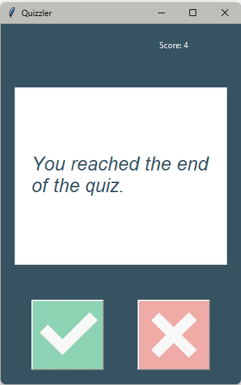
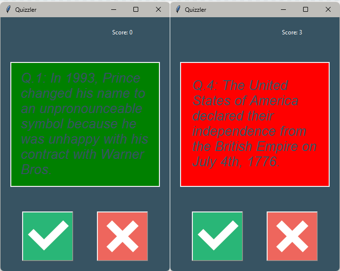
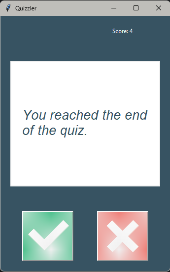

# Quizzler – True/False Quiz App

> Python exercise focused on GUI programming, OOP, and API-based quiz data.

This project is a **True/False Quiz Application** built using Python and Tkinter.  
It loads questions, displays them one by one, and lets the user answer using buttons.  
The score updates dynamically, and the interface provides visual feedback after each answer.

## Features

- Tkinter-based graphical interface  
- Clean separation of logic (QuizBrain) and UI  
- Event‑driven interaction using button callbacks  
- Real‑time score updates  
- Feedback colors (green/red) for correct/incorrect answers  
- Auto‑advance to the next question  
- Graceful end‑of‑quiz handling  

## ScreenShots
* Program


* Program visual feedback (When `Right` or `Wrong`)


* Program when you reached the end of the quizz



## Learning Goals

- Practice GUI programming with Tkinter  
- Understand callbacks and event loops  
- Implement object‑oriented organization in Python  
- Work with class interactions (UI ⇆ QuizBrain)  
- Use APIs or predefined data sources  
- Manage state and control flow in a GUI app  

## How to Run
```
python main.py
```

## File Structure
- `main.py` — initializes the quiz and GUI  
- `ui.py` — handles all interface elements  
- `quiz_brain.py` — contains quiz logic and answer validation  
- `question_model.py` — simple Question class  
- `data.py` — question data source  
- `images/` — icons for True/False buttons  

## Requirements
```
No external libraries required besides the Python standard library.
```

## Example Behavior

```
Q1: The moon is drifting away from Earth.  
User clicks: TRUE  
Feedback: ✓ background turns green  
Score: 1  

Next question loads automatically…
```

## License
This project is free to use and modify for educational purposes.
